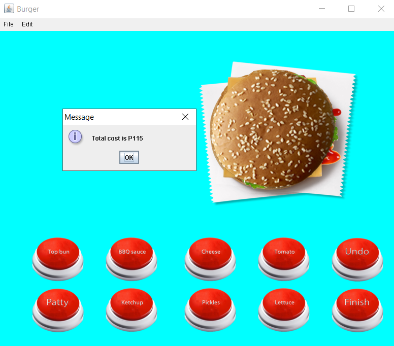

# SanTayoKakain
LBYCP12 Project by Isobe, Navarro and Or 

#Additional Implementation

Graph Implementation to compute the price of the food ordered.

Additional documentation
Contribution of Group Members: 

Takeshi Isobe - Edited pictures for Project, GUI of Icecream, and queue implementation.

Christian Navarro - GUI of main menu, burger, and pizza. Array and stack implementation.

Irene Or - Helped with JFrame implementation. Graph implementation. 

